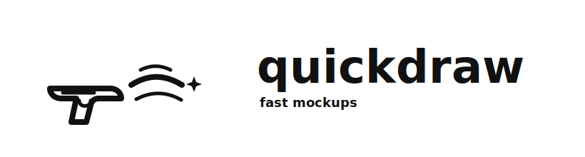

# quickdraw



A tiny AI-first PNG tool: render simple scene specs headlessly, or open a fast browser canvas for screenshot/image annotation.

## Install

Download the `quickdraw` executable from the latest GitHub Release, then put it somewhere on your `PATH`:

```bash
mkdir -p ~/.local/bin
curl -L -o ~/.local/bin/quickdraw \
  https://github.com/Yeshwanthyk/quickdraw/releases/latest/download/quickdraw
chmod +x ~/.local/bin/quickdraw
quickdraw --help
```

On macOS, if Gatekeeper marks the downloaded file as quarantined:

```bash
xattr -d com.apple.quarantine ~/.local/bin/quickdraw
```

If you use `~/commands` instead:

```bash
mkdir -p ~/commands
curl -L -o ~/commands/quickdraw \
  https://github.com/Yeshwanthyk/quickdraw/releases/latest/download/quickdraw
chmod +x ~/commands/quickdraw
```

## Upgrade

Once installed, update in place to the latest release:

```bash
quickdraw upgrade
```

This downloads the latest release asset and replaces the running executable. Check your version with `quickdraw version`.

## Publishing a release

The release asset is `dist/quickdraw`, built via `bun run build:command dist/quickdraw`, then attached to a GitHub Release (e.g. `gh release create v0.1.2 dist/quickdraw`). `quickdraw upgrade` and the `curl` commands above pull from `releases/latest`.

## Install the agent skill

This repo includes `SKILL.md` for Claude, Codex, Pi, and other agents that support filesystem skills. After installing the `quickdraw` command, tell your agent:

> Install the quickdraw skill from this repo's `SKILL.md` into my agent skills directory as `quickdraw`.

Manual install examples:

```bash
# Claude Code
mkdir -p ~/.claude/skills/quickdraw
cp SKILL.md ~/.claude/skills/quickdraw/SKILL.md

# Codex
mkdir -p ~/.codex/skills/quickdraw
cp SKILL.md ~/.codex/skills/quickdraw/SKILL.md

# Pi
mkdir -p ~/.pi/agent/skills/quickdraw
cp SKILL.md ~/.pi/agent/skills/quickdraw/SKILL.md
```

If you sync skills through a dotfiles/gitgud directory, copy it there instead and symlink agent-specific skill folders to it:

```bash
mkdir -p ~/.gitgud/skills/quickdraw
cp SKILL.md ~/.gitgud/skills/quickdraw/SKILL.md
ln -sfn ~/.gitgud/skills/quickdraw ~/.claude/skills/quickdraw
ln -sfn ~/.gitgud/skills/quickdraw ~/.codex/skills/quickdraw
ln -sfn ~/.gitgud/skills/quickdraw ~/.pi/agent/skills/quickdraw
```

## Use

```bash
quickdraw render --spec scene.json --out /tmp/diagram.png
echo '{"shapes":[...]}' | quickdraw render --spec - --out /tmp/diagram.png --json
echo '{"shapes":[...]}' | quickdraw render --spec - --ascii            # box-drawing text to stdout
quickdraw render --spec scene.json --ascii --out /tmp/diagram.txt      # or a monospace .png
echo 'graph LR; A-->B' | quickdraw render --mermaid - --out /tmp/flow.png --json
echo 'digraph { A -> B }' | quickdraw render --dot - --out /tmp/graph.png --json
quickdraw inspect /tmp/diagram.png --json
quickdraw open --spec scene.json image.png
quickdraw                         # blank canvas
quickdraw edit image.png          # annotate an image
quickdraw paste                   # annotate clipboard PNG
quickdraw shot                    # take a macOS screenshot, then annotate
quickdraw --json                  # machine-readable result
quickdraw shot --context markdown # print a Markdown image reference
quickdraw shot --context json     # print the full context envelope
quickdraw shot --context codex --paste # paste Markdown back to focused app
```

Browser output is a PNG under `/tmp/quickdraw-xxxxxxxx.png`. Rendered output goes to `--out`. The image is also copied to the macOS clipboard when possible.

`--context` controls the handoff string agents inject after Save:
- `token`: `@/tmp/quickdraw-xxxxxxxx.png` (default)
- `markdown`: ``
- `codex`: same Markdown image reference, tuned for Codex chat rendering
- `json`: `{ kind: "quickdraw.context.v1", artifact, scene, token, markdown, inspect }`

`--json` keeps the legacy result shape and adds `sha256`, `token`, `markdown`, and `inspect`. Use `--context json` when the caller wants the full recoverable context envelope.

Minimal scene spec:

```json
{
  "canvas": { "width": 800, "height": 500 },
  "shapes": [
    { "type": "rect", "x": 40, "y": 160, "width": 200, "height": 80, "color": "blue", "label": "Login Form" },
    { "type": "arrow", "from": [240, 200], "to": [300, 200], "color": "red", "label": "submit" },
    { "type": "text", "x": 40, "y": 280, "width": 180, "text": "Step 1", "color": "dark", "fontSize": 16 }
  ]
}
```

Supported shapes: `rect`, `redact`, `arrow`, `text`, `pen`, `highlight`. Text supports optional `width`, `lineHeight`, `fontSize`, `fontFamily`, and `textAlign`; fixed-width text wraps. Named colors: `red`, `orange`, `yellow`, `green`, `blue`, `dark`, `black`, `white`.

Arrows can bind to a shape: set `startBinding`/`endBinding` to `{ "shapeId": "...", "ratio": [0..1, 0..1] }` and that endpoint re-routes when the shape moves or resizes. In the browser, drawing an arrow ending inside a shape binds it automatically.

ASCII rendering (`--ascii`) draws the scene with box-drawing characters and resolves line overlaps into junctions (`├ ┼ ┤ ┬ ┴`). `rect`/`arrow` accept `strokeStyle: "single" | "bold" | "double"` and `dashed: true`; `rect` also accepts `rounded: true`. These style fields only affect ASCII output and are ignored by the pixel/PNG renderers. `--ascii` writes text to stdout or `--out file.txt`, or a monospace PNG when `--out` ends in `.png`.

Adapter renders:
- `--mermaid` uses `mmdc` when installed, otherwise `bunx @mermaid-js/mermaid-cli`.
- `--dot` uses Graphviz `dot` when installed, otherwise `bunx @hpcc-js/wasm-graphviz-cli`.
- `inspect` returns adapter/source metadata for adapter PNGs; edit that source and rerender rather than passing it to `open --spec`.

## Drawing shortcuts

| Key | Tool |
| --- | --- |
| `1` | Select |
| `2` | Pen |
| `3` | Highlighter |
| `4` | Arrow |
| `5` | Rectangle |
| `6` | Text |
| `7` | Redact |

Selection mode supports click-to-select, Shift-click multi-select, drag-to-move, arrow-key nudging, resize/rotation handles, z-order buttons, and `Delete`/`Backspace`. Selected arrows expose endpoint handles instead of generic resize handles.

## Build a release executable

The release executable is a self-extracting zsh script containing the Vite app payload and `node_modules`. It requires Bun on the target machine.

```bash
bun install
scripts/build-command.sh dist/quickdraw
shasum -a 256 dist/quickdraw > dist/quickdraw.sha256
```

Verify the artifact:

```bash
dist/quickdraw --help
bun run smoke
```

Upload both files to the GitHub Release for the current tag.

## Development

```bash
bun install
bun run typecheck
bun run smoke
bun run dev
```

## Requirements

- macOS for clipboard, screenshot, and paste-back modes.
- Bun installed on machines running the downloadable executable.
- A browser available for the drawing UI.
